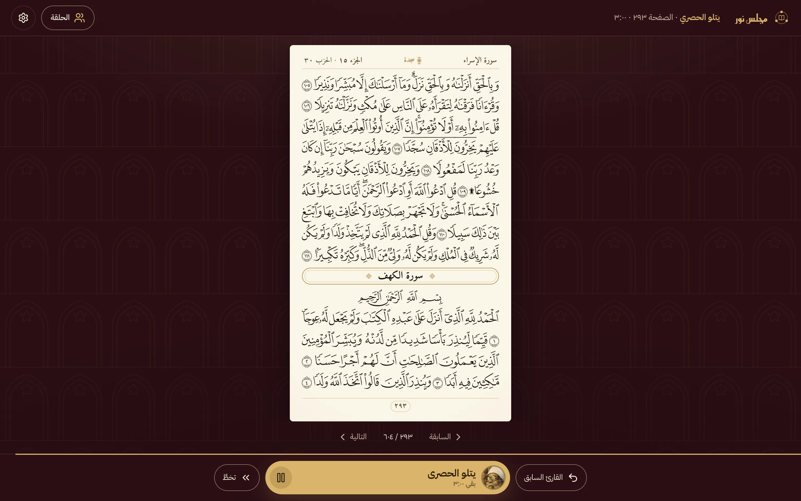
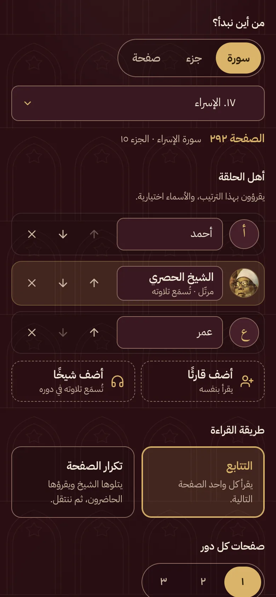
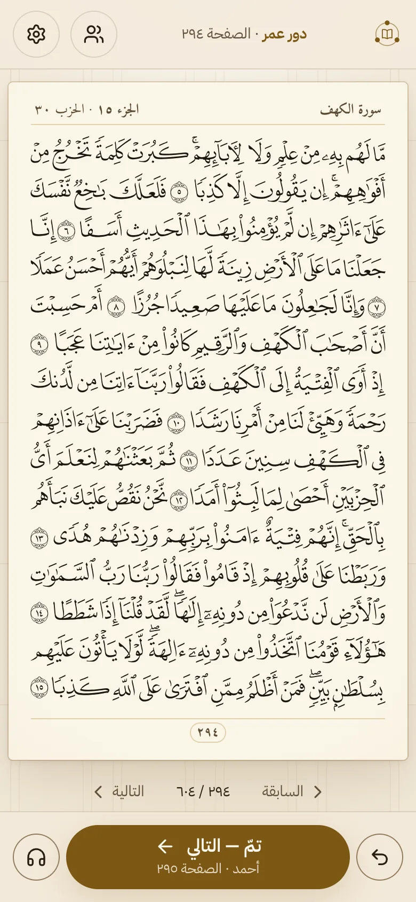
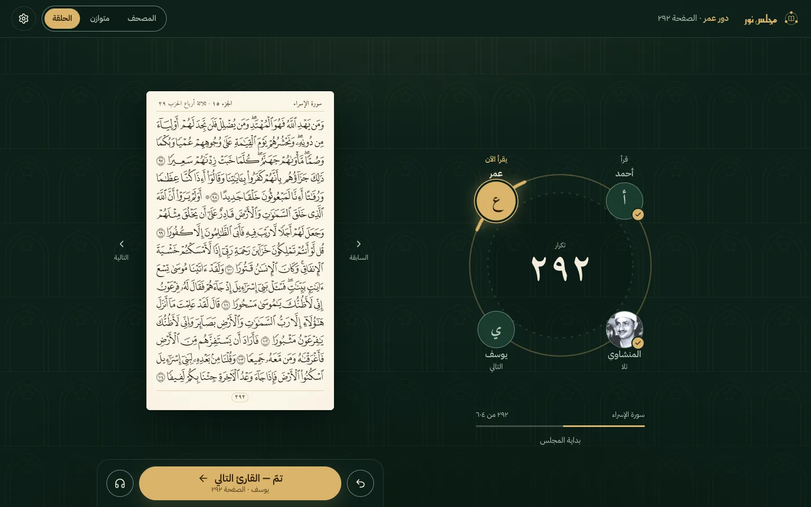

# مجلس نور

[افتح التطبيق](https://edriso.github.io/majlis-noor/)

مجلس نور حلقةُ قرآنٍ صغيرة على الشاشة، كما يجلس القرّاء في حلقة المسجد: يتناوبون القراءة في مصحف المدينة النبوية صفحةً صفحة؛ يقرأ الأول صفحته، ثم الثاني، ثم الثالث، ثم يعود الدور إلى الأول. ويجلس معهم إن شاؤوا شيخٌ من كبار القرّاء: إذا جاء دوره تُليت صفحته بصوته، ثم انتقل الدور إلى من يليه.

افتح التطبيق، واختر حلقتك، واقرؤوا معًا. لا حساب ولا خادم، وكل شيء يبقى على جهازك.



<p>
  
  
</p>



## ما في الحلقة

- **مصحف المدينة كما طُبع**: الصفحات الـ٦٠٤ لطبعة مجمع الملك فهد لطباعة المصحف الشريف برواية حفص، كل صفحة بخطّها الخاص وأسطرها الخمسة عشر، لا نصٌّ مُعاد التنسيق. اسم السورة والجزء والحزب في أعلى الصفحة ورقمها في أسفلها، وعلامة السجدة حيث تكون.
- **من مقعد إلى أربعة، بالترتيب الذي تختارون**: أضيفوا القرّاء بأسمائهم (والأسماء اختيارية؛ فالأول «أنت» ما لم تُسمِّه)، وقدِّموا وأخِّروا من شئتم بزرّين بجانب كل اسم، فيدور الدور بهذا الترتيب.
- **شيخ في الحلقة**: أضيفوا أحد القرّاء العشرة مقعدًا كأيّ واحد منكم. إذا جاء دوره تُليت صفحته بصوته، والصفحة تتقلّب مع تلاوته، ثم ينتقل الدور وحده إلى من بعده. ومع «تكرار الصفحة» وشيخٍ في المقعد الأول تصير الحلقة تلقينًا: يتلو الشيخ الصفحة، ثم يقرؤها الحاضرون بعده واحدًا واحدًا.
- **طريقتان للقراءة**:
  - **التتابع**: يقرأ كل واحد الصفحة التالية (الأول ٢٠، الثاني ٢١، الثالث ٢٢، ثم الأول ٢٣…).
  - **تكرار الصفحة**: يقرأ الجميع الصفحة نفسها ثم ينتقلون إلى التي بعدها، للتصحيح والحفظ والاستماع بعضهم لبعض.
- **صفحة أو صفحتان أو ثلاث في كل دور**.
- **البدء من سورة أو جزء أو صفحة**، ورقم الصفحة ظاهر دائمًا.
- **زرّ واحد ينقل الدور**: «تمّ — القارئ التالي»، وتحته اسم من يليه وصفحته. ومعه «القارئ السابق». وفي دور الشيخ يصير الزرّ نفسه إيقافًا للتلاوة واستئنافًا لها، وبجانبه «تخطَّ».
- **أو بتوقيت قارئ**: يُقاس دور القارئ بمدة تلاوة قارئ مختار للصفحة نفسها، فيظهر عدّاد هادئ وينتقل الدور حين ينتهي، مع زرّ للإيقاف المؤقت. والانتقال اليدوي هو الأصل.
- **استمع إلى الصفحة**: تلاوة الصفحة الحالية بصوت القارئ المختار، قبل القراءة أو بعدها، تُوقَف وتُستأنف بالزرّ نفسه.
- **إيقاف واحد يوقف كل شيء**: إيقاف التوقيت يوقف معه التلاوة التي تُسمَع، والاستئناف يعيدهما معًا.
- **عشرة قرّاء بصورهم، مجموعين بحسب أدائهم**: متأنٍّ جدًّا، ومتأنٍّ، ومعتدل، وسريع؛ وبجانب كلٍّ متوسط مدة صفحته، وزرّ تسمعه به يتلو الفاتحة قبل أن تختاره: الحصري (المعلّم والمرتّل)، وعبد الباسط، والعفاسي، والمنشاوي، والدوسري، والشاطري، والرفاعي، والسديس، والشريم.
- **صور القرّاء كما تحب**: ظاهرة، أو مموّهة لا تُعرف بها الوجوه، أو مخفية فلا تُحمَّل أصلًا ويظهر مكانها الحرف الأول من الاسم. من زرّ «المظهر» في شاشة البداية، أو من الإعدادات.
- **الحلقة مرسومة، وهي ترتيب القراءة**: أهل الحلقة حول دائرة بترتيبهم، ومن عليه الدور مضاء بالذهبي، وعلامة تنتقل على الدائرة من مقعد إلى مقعد. وتحت كل مقعد ما يفعله: يقرأ الآن، أو التالي، أو قرأ، أو صفحته القادمة.
- **شاشة هادئة**: على الحاسوب صفحة المصحف وبجانبها الحلقة لا غير، معًا في وسط الشاشة. وثلاثة أوضاع: المصحف (الصفحة كبيرة)، ومتوازن، والحلقة (لمن يدير الجلسة).
- **أربعة ألوان**: أخضر (وهو الأصل) وعنّابي وأزرق كسجّاد المسجد ليلًا، ورملي فاتح للنهار والغرف المضيئة، بنقش خفيف لا يزاحم المصحف.
- **تُحفظ الحلقة على جهازك**: إن أُعيد تحميل الصفحة عُرض عليك أن تتابع من الصفحة نفسها والقارئ نفسه.
- **الختم**: إذا بلغت الحلقة آخر المصحف قيل «خُتم المصحف»، وعُرضت ختمة جديدة من الفاتحة.
- **يبقى الهاتف مضاءً** ما دامت الحلقة مفتوحة، و**يعمل دون اتصال** للصفحات التي فُتحت من قبل. وتظهر تلاوة الشيخ على شاشة القفل، وتتحكم بها أزرار السمّاعة.

## لوحة المفاتيح

| المفتاح | ما يفعله                                                    |
| ------- | ----------------------------------------------------------- |
| `←`     | تمّ، القارئ التالي (أو الصفحة التالية في الدور)، أو تخطَّ الشيخ |
| `→`     | رجوع إلى الصفحة أو القارئ السابق                           |
| `مسافة` | إيقاف تلاوة الشيخ أو التوقيت أو الاستماع مؤقتًا، واستئنافها    |

الأسهم تقلب الصفحة كما يُقلب الكتاب العربي: اليسار إلى الأمام.

## سهولة الوصول

الواجهة عربية من اليمين إلى اليسار، وكل زرّ له اسم يقرؤه قارئ الشاشة، ولا يقلّ زرّ على الهاتف عن ٤٤ بكسل، وتباين النصوص يوافق WCAG AA في الألوان الأربعة. وتحت كل سطر من خطّ المصحف نصّه العثماني مقروءًا لقارئ الشاشة، ويُعلَن انتقال الدور حين يقع، ويُعلَن كل تقديم أو تأخير أو إضافة في أهل الحلقة. ومن طلب تقليل الحركة في نظامه سكنت له الحركة.

## المصادر

- **صفحات المصحف**: تخطيط الأسطر ورموز الخطوط ونصّ الكلمات من [Quran.com](https://quran.com)، وخطوط الصفحات من مجمع الملك فهد تُحمَّل عند القراءة.
- **التلاوات وتوقيتها**: من [QuranicAudio](https://quranicaudio.com) وواجهة Quran.com.
- **صور القرّاء**: من ويكيميديا كومنز، ولكلّ صورة مصدرها وترخيصها في [NOTICE](NOTICE).

## للمطوّرين

```sh
npm install
npm run dev        # خادم محلي
npm test           # الاختبارات
npm run lint       # oxlint
npm run build      # فحص الأنواع ثم البناء
```

اقرأ [AGENTS.md](AGENTS.md) قبل أي تعديل، ثم [docs/CONTRIBUTING.md](docs/CONTRIBUTING.md) لأول تغيير. ويُنشر التطبيق على GitHub Pages تلقائيًا عند كل دفع إلى `main`.

كان اسم التطبيق «مجلس آية»، والحلقة المحفوظة باسمه القديم تُنقل إلى الجديد وحدها.

## الترخيص

كل ما كُتب لهذا المستودع تحت [0BSD](LICENSE): خذه واستعمله بلا شرط. وما يُعاد توزيعه من غيرنا (بيانات المصحف، وصور القرّاء) له شروطه في [NOTICE](NOTICE).
